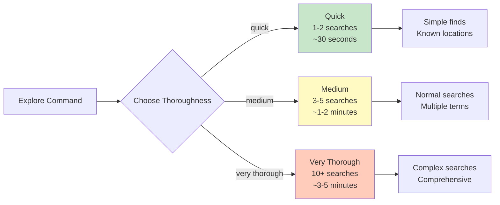
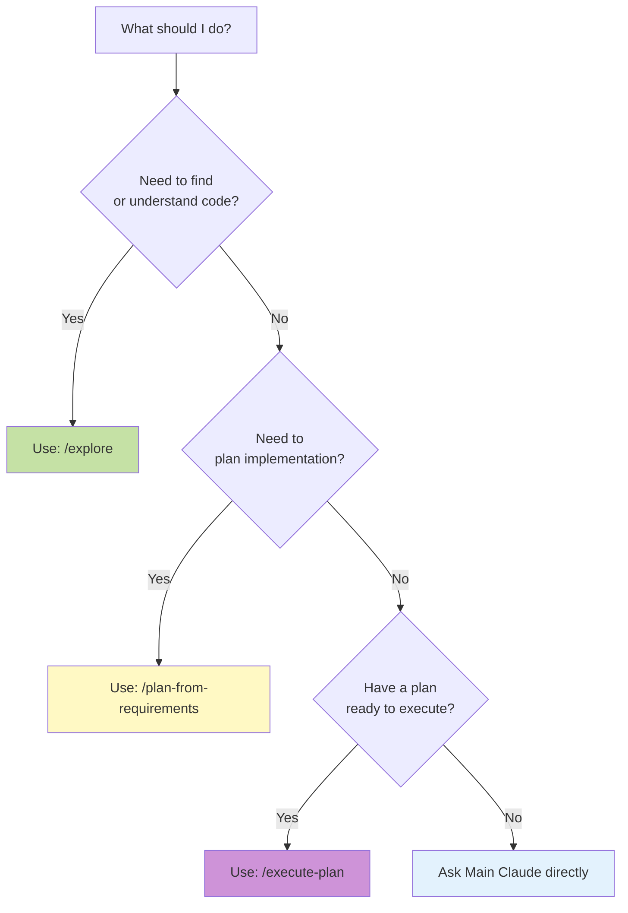

# 🤖 Claude Code Development Workflow

> **Comprehensive guide to using Claude Code agents and commands for efficient development**

---

## 📋 Table of Contents

- [Overview](#overview)
- [The Agent System](#the-agent-system)
- [Command Reference](#command-reference)
- [Workflow Patterns](#workflow-patterns)
- [Best Practices](#best-practices)
- [Examples](#examples)

---

## Overview

Claude Code uses an **agent-based architecture** where specialized AI agents handle different aspects of development. This enables:

- 🎯 **Focused expertise** - Each agent specializes in specific tasks
- ⚡ **Parallel execution** - Multiple agents can work simultaneously
- 🔄 **Autonomous operation** - Agents complete complex tasks independently
- 📊 **Better results** - Specialized agents produce higher quality output

### Core Philosophy

```mermaid
graph LR
    A[Understand<br/>Requirements] -->|Plan Agent| B[Plan<br/>Approach]
    B -->|Plan Agent| C[Design<br/>Solution]
    C -->|General Purpose| D[Execute<br/>Implementation]
    D --> E[Review<br/>& Test]
    E -->|Issues Found| A
    E -->|Complete| F[✅ Done]

    style A fill:#e3f2fd
    style B fill:#fff9c4
    style C fill:#fff9c4
    style D fill:#c5e1a5
    style E fill:#ffccbc
    style F fill:#a5d6a7
```



---

## The Agent System

### Agent Types Overview

| Agent | Icon | Purpose | Speed | Use When |
|-------|------|---------|-------|----------|
| **general-purpose** | 💻 | Complex multi-step tasks | Medium | Default for most tasks |
| **Explore** | 🔍 | Codebase exploration | Fast | Finding code, understanding structure |
| **Plan** | 🏗️ | Planning implementations | Fast | Before implementing features |
| **statusline-setup** | ⚙️ | Configure status line | Fast | UI configuration |

### Agent Architecture

```mermaid
graph TD
    Dev[👤 Developer<br/>Gives Commands] --> Main[🤖 Claude Main<br/>Orchestrator]
    Main -->|Quick Search| Explore[🔍 Explore Agent<br/>Fast Codebase Search]
    Main -->|Design Solution| Plan[🏗️ Plan Agent<br/>Planning & Design]
    Main -->|Implement| GP[💻 General Purpose<br/>Full Implementation]

    Explore -.->|Findings| Plan
    Plan -.->|Plan| GP
    GP -.->|Results| Main
    Main -.->|Response| Dev

    style Dev fill:#e3f2fd
    style Main fill:#fff9c4
    style Explore fill:#c5e1a5
    style Plan fill:#ffccbc
    style GP fill:#ce93d8
```



---

## Agent Deep Dive

### 🔍 Explore Agent

**Purpose:** Fast codebase exploration and searching

**Capabilities:**
- Find files by patterns (glob)
- Search code for keywords
- Answer questions about codebase
- Identify relationships between components

**Tools Available:**
- ✅ Read files
- ✅ Search (Grep)
- ✅ Find files (Glob)
- ✅ Web search (if needed)

**When to Use:**

| ✅ Use Explore Agent For | ❌ Do NOT Use For |
|------------------------|------------------|
| Finding feature implementations | Implementing code |
| Understanding codebase structure | Running tests |
| Locating functions/classes | Complex execution analysis |
| Searching for usage patterns | Writing code |
| Answering "where is X?" questions | Modifying files |
| Exploring multiple locations | Planning implementations |

**Thoroughness Levels:**



**Example Usage:**

```bash
# Quick search for authentication code
/explore "quick" Find all authentication-related files

# Medium search for tax calculator
/explore "medium" How does the tax calculation work?

# Very thorough search for projection engine
/explore "very thorough" Find all components involved in {{project_type}} projections
```

### 🏗️ Plan Agent

**Purpose:** Planning implementations before coding

**Capabilities:**
- Analyze requirements
- Design solutions
- Break down into steps
- Identify dependencies
- Consider edge cases
- Propose architecture

**Tools Available:**
- ✅ Read files
- ✅ Search (Grep)
- ✅ Find files (Glob)
- ✅ Web search (if needed)

**When to Use:**

| ✅ Use Plan Agent For | ❌ Do NOT Use For |
|----------------------|------------------|
| Starting new features | Implementing the plan |
| Refactoring existing code | Simple, obvious changes |
| Unsure of implementation approach | Fixing typos or formatting |
| Need to understand dependencies | Trivial modifications |
| Validate approach before coding | Direct code execution |
| Complex features requiring design | Quick one-line fixes |

**Planning Output:**

A typical plan includes the following structure:

**1. Analysis**
- Requirements understanding
- Current state assessment
- Constraints identification

**2. Design**
- Proposed architecture
- Component breakdown
- Data flow
- Integration points

**3. Implementation Steps**
- Step 1: Foundation
- Step 2: Core logic
- Step 3: Integration
- Step 4: Testing

**4. Considerations**
- Edge cases
- Performance implications
- Testing strategy
- Migration path

**Example Usage:**

```bash
# Plan a new feature
/plan-from-requirements Add ability to export projects to Excel format

# Plan a refactoring
/plan-from-requirements Refactor projection engine to support couples

# Plan an optimization
/plan-from-requirements Improve performance of year-by-year calculations
```

### 💻 General Purpose Agent

**Purpose:** Execute complex multi-step tasks autonomously

**Capabilities:**
- Research and exploration
- Code implementation
- Test writing
- File manipulation
- Running commands
- Multi-step workflows

**Tools Available:**
- ✅ **ALL TOOLS** - Complete access to entire toolkit

**When to Use:**

| ✅ Use General Purpose Agent For | ❌ Do NOT Use For |
|----------------------------------|------------------|
| Implementing features (after planning) | Simple exploration (use Explore) |
| Complex refactoring tasks | Planning (use Plan) |
| Writing comprehensive tests | Trivial single-file edits |
| Multi-file changes | Quick searches |
| Tasks requiring execution (bash, tests) | Just reading code |
| Following a detailed plan | Ad-hoc questions |

**Typical Workflow:**

The General Purpose Agent follows a systematic approach:

**1. Understand**
- Read relevant files
- Search for related code
- Understand context

**2. Implement**
- Write domain layer
- Write data layer
- Write application layer
- Write presentation layer

**3. Test**
- Write unit tests
- Write widget tests
- Run tests
- Fix failures

**4. Verify**
- Run analysis
- Check formatting
- Final validation

**Example Usage:**

```bash
# Execute a plan
/execute-plan <plan-id>

# Implement with guidance
Implement the tax calculator following Clean Architecture principles

# Complex task
Refactor the scenario comparison to support up to 10 scenarios
```

---

## Command Reference

### 🎯 Primary Commands

#### `/plan-from-requirements`

**Purpose:** Analyze requirements and create an implementation plan

**Syntax:**
```bash
/plan-from-requirements <requirement description>
```

**What It Does:**

```mermaid
flowchart TD
    A[User Gives Requirement] --> B[Plan Agent Activates]
    B --> C[Analyze Requirement]
    C --> D[Explore Codebase]
    D --> E[Design Solution]
    E --> F[Create Step-by-Step Plan]
    F --> G[Present Plan to User]
    G --> H{User Decision}
    H -->|Approve| I[/execute-plan]
    H -->|Modify| J[Refine Plan]
    H -->|Reject| A
    J --> G

    style A fill:#e3f2fd
    style B fill:#fff9c4
    style C fill:#fff9c4
    style D fill:#c5e1a5
    style E fill:#c5e1a5
    style F fill:#ffccbc
    style G fill:#ce93d8
    style I fill:#a5d6a7
```

**Example Scenarios:**

```bash
# New Feature
/plan-from-requirements Add support for importing projects from CSV files

# Refactoring
/plan-from-requirements Migrate from Hive to SQLite for local storage

# Bug Fix (complex)
/plan-from-requirements Fix memory leak in projection calculation engine

# Optimization
/plan-from-requirements Reduce app startup time by 50%

# Integration
/plan-from-requirements Integrate with Plaid API for bank account connections
```

**Expected Output:**

```markdown
## Implementation Plan: <Feature Name>

### Analysis
- Current state: ...
- Requirements: ...
- Constraints: ...

### Proposed Solution
- Architecture: ...
- Components affected: ...
- Data flow: ...

### Implementation Steps
1. Step 1: ...
   - Subtask A
   - Subtask B
2. Step 2: ...
   - Subtask A
   - Subtask B

### Testing Strategy
- Unit tests: ...
- Integration tests: ...
- Manual testing: ...

### Risks & Considerations
- Risk 1: ...
- Risk 2: ...

### Estimated Effort
- Time: X hours/days
- Complexity: Low/Medium/High
```

#### `/execute-plan`

**Purpose:** Execute a previously created plan

**Syntax:**
```bash
/execute-plan <plan-id>
# or
/execute-plan  # (uses most recent plan)
```

**What It Does:**



```mermaid
flowchart TD
    A[User Approves Plan] --> B[General Purpose Agent Starts]
    B --> C[Step 1: Foundation]
    C --> D[Implement]
    D --> E[Test]
    E --> F{Tests Pass?}
    F -->|No| D
    F -->|Yes| G[Step 2: Core Logic]
    G --> H[Implement]
    H --> I[Test]
    I --> J{Tests Pass?}
    J -->|No| H
    J -->|Yes| K[Step 3: Integration]
    K --> L[Implement]
    L --> M[Test]
    M --> N{Tests Pass?}
    N -->|No| L
    N -->|Yes| O[Final Verification]
    O --> P[Run All Tests]
    P --> Q[Check Coverage]
    Q --> R[Format Code]
    R --> S[✅ Complete]

    style A fill:#e3f2fd
    style B fill:#fff9c4
    style C fill:#c5e1a5
    style G fill:#c5e1a5
    style K fill:#c5e1a5
    style O fill:#ffccbc
    style S fill:#a5d6a7
```

**Monitoring Execution:**

The agent provides real-time progress updates as it executes each step:

| Step | Component | Status | Progress |
|------|-----------|--------|----------|
| **1. Domain Entities** | Individual entity | ✅ Complete | 80% |
| | Scenario entity | ✅ Complete | |
| | Asset entity | 🔄 In Progress | |
| | Tests | ⏳ Pending | |
| **2. Repository** | Interface definition | ⏳ Pending | 0% |
| | Firestore implementation | ⏳ Pending | |
| | Tests | ⏳ Pending | |

### 🔧 Utility Commands

#### `/explore`

**Purpose:** Quick codebase exploration

**Syntax:**
```bash
/explore "<thoroughness>" <query>
```

**Thoroughness Options:**
- `"quick"` - Fast scan (30s)
- `"medium"` - Standard search (1-2 min)
- `"very thorough"` - Deep analysis (3-5 min)

**Examples:**

```bash
# Find authentication implementation
/explore "quick" Where is Google Sign-In implemented?

# Understand tax calculation
/explore "medium" How does the {{TARGET_REGION}} tax calculator work?

# Comprehensive search
/explore "very thorough" Find all files related to {{project_type}} projections
```

---

## Workflow Patterns

### Pattern 1: New Feature Development

```mermaid
graph TD
    A[Step 1: Understand Requirements] --> B[User Describes Feature]
    B --> C[Step 2: Explore Context]
    C --> D[/explore similar features]
    D --> E[Step 3: Create Plan]
    E --> F[/plan-from-requirements]
    F --> G[Step 4: Review Plan]
    G --> H{Approved?}
    H -->|No| I[Refine Plan]
    I --> G
    H -->|Yes| J[Step 5: Execute]
    J --> K[/execute-plan]
    K --> L[Step 6: Verify]
    L --> M[Run Tests]
    M --> N[Manual Testing]
    N --> O{All Pass?}
    O -->|No| J
    O -->|Yes| P[✅ Feature Complete]

    style A fill:#e3f2fd
    style C fill:#c5e1a5
    style E fill:#fff9c4
    style G fill:#ffccbc
    style J fill:#ce93d8
    style L fill:#ffe082
    style P fill:#a5d6a7
```

**Real Example:**

```bash
# 1. User request
"I need to add Excel export functionality for {{project_type}} projections"

# 2. Explore context
/explore "medium" Find existing export functionality

# 3. Create plan
/plan-from-requirements Add Excel export for {{project_type}} projections with
formatting, charts, and summary tables

# 4. Review plan (agent presents plan)
# User: "Looks good, let's proceed"

# 5. Execute
/execute-plan

# 6. Verify
# Agent runs tests, formats code, presents result
```

### Pattern 2: Bug Investigation & Fix

```mermaid
graph TD
    A[Step 1: Bug Report] --> B[User Describes Issue]
    B --> C[Step 2: Investigate]
    C --> D[/explore quick: Find code]
    D --> E[Read Error Logs]
    E --> F[Reproduce Issue]
    F --> G[Step 3: Diagnose]
    G --> H{Complex Bug?}
    H -->|Yes| I[Step 4: Plan Fix<br/>/plan-from-requirements]
    H -->|No| J[Step 5: Implement Fix]
    I --> J
    J --> K[Fix Bug + Add Regression Test]
    K --> L[Step 6: Validate]
    L --> M[Run Full Test Suite]
    M --> N{All Pass?}
    N -->|No| G
    N -->|Yes| O[✅ Bug Fixed]

    style A fill:#ffcdd2
    style C fill:#c5e1a5
    style G fill:#fff9c4
    style I fill:#ce93d8
    style J fill:#90caf9
    style L fill:#ffe082
    style O fill:#a5d6a7
```

**Real Example:**

```bash
# 1. Bug report
"Projection calculation fails for couples when one partner retires before 60"

# 2. Investigate
/explore "quick" Find projection calculation code

# 3. Diagnose
# Read code, identify issue in age validation logic

# 4. Plan (if complex)
/plan-from-requirements Fix projection calculation for early {{project_type}} in couples

# 5. Implement
/execute-plan

# 6. Validate
# Tests pass, manual verification confirms fix
```

### Pattern 3: Refactoring

```mermaid
graph TD
    A[Step 1: Identify Need] --> B[Code Smell or<br/>Performance Issue]
    B --> C[Step 2: Analyze]
    C --> D[/explore medium:<br/>Current Implementation]
    D --> E[/explore medium:<br/>Find Dependencies]
    E --> F[Step 3: Design Refactoring]
    F --> G[/plan-from-requirements]
    G --> H[Step 4: Review Impact]
    H --> I[Check Affected Components]
    I --> J[Ensure Backward Compatibility]
    J --> K{Migration<br/>Needed?}
    K -->|Yes| L[Plan Migration]
    K -->|No| M[Step 5: Execute]
    L --> M
    M --> N[/execute-plan]
    N --> O[Step 6: Verify]
    O --> P[Run All Tests]
    P --> Q[Performance Benchmarks]
    Q --> R{Regression?}
    R -->|Yes| C
    R -->|No| S[✅ Refactoring Complete]

    style A fill:#fff9c4
    style C fill:#c5e1a5
    style F fill:#ce93d8
    style H fill:#ffccbc
    style M fill:#90caf9
    style O fill:#ffe082
    style S fill:#a5d6a7
```

**Real Example:**

```bash
# 1. Identify need
"Projection engine is slow with 10+ scenarios"

# 2. Analyze
/explore "medium" How is projection engine currently implemented?
/explore "medium" Find all places that call projection engine

# 3. Design
/plan-from-requirements Refactor projection engine to calculate scenarios
in parallel and cache intermediate results

# 4. Review plan
# User reviews, suggests keeping serial for <5 scenarios

# 5. Execute
/execute-plan

# 6. Verify
# Run performance benchmarks, verify 50% improvement
```

---

## Best Practices

### When to Use Each Agent

```mermaid
flowchart TD
    Start[What do you need?] --> Q1{Find or understand<br/>existing code?}
    Q1 -->|Yes| Explore[🔍 Use Explore Agent]
    Q1 -->|No| Q2{Complex task<br/>requiring multiple steps?}
    Q2 -->|No| Main[💬 Ask Main Claude]
    Q2 -->|Yes| Q3{Do you have<br/>a plan?}
    Q3 -->|No| Plan[🏗️ Use Plan Agent<br/>/plan-from-requirements]
    Q3 -->|Yes| GP[💻 Use General Purpose<br/>/execute-plan]

    Plan -.->|Creates plan| Q3

    style Explore fill:#c5e1a5
    style Plan fill:#fff9c4
    style GP fill:#ce93d8
    style Main fill:#e3f2fd
```



### Agent Collaboration

**Optimal workflow** uses multiple agents:

```mermaid
sequenceDiagram
    participant User
    participant Explore as 🔍 Explore Agent
    participant Plan as 🏗️ Plan Agent
    participant GP as 💻 General Purpose

    User->>Explore: Find similar features
    Explore->>Explore: Search codebase
    Explore-->>Plan: Findings: Current architecture

    User->>Plan: Create implementation plan
    Plan->>Plan: Design solution using findings
    Plan-->>User: Present plan

    User->>GP: Execute plan
    GP->>GP: Implement & Test
    GP-->>User: ✅ Feature Complete

    Note over Explore,GP: Agents work sequentially,<br/>each building on previous results
```



### Parallel vs Sequential

**When to run in parallel:**

```bash
# ✅ Good - Independent investigations
/explore "quick" Find authentication code
/explore "quick" Find database layer

# ✅ Good - Multiple unrelated tasks
Task 1: Implement feature A
Task 2: Fix bug in feature B
```

**When to run sequentially:**

```bash
# ✅ Good - Dependent tasks
1. /explore "medium" Understand current implementation
2. /plan-from-requirements Design improvement (uses exploration results)
3. /execute-plan (uses the plan)

# ❌ Bad - Planning before understanding
/plan-from-requirements Add feature X  # Should explore first!
```

---

## Examples

### Example 1: Complete Feature Implementation

**Requirement:** "Add ability to duplicate scenarios with custom modifications"

```bash
# Step 1: Explore (understand current scenario management)
/explore "medium" How are scenarios currently created and managed?

# Agent Response:
# - Scenarios created via ScenarioFormScreen
# - Stored in Firestore via ScenarioRepository
# - Displayed in ScenarioListScreen
# - No duplicate functionality exists

# Step 2: Plan
/plan-from-requirements Add ability to duplicate scenarios with custom
name and allow user to modify parameters before saving the duplicate

# Agent presents plan:
# 1. Add duplicateScenario method to ScenarioRepository
# 2. Add Duplicate menu item to scenario list
# 3. Create DuplicateScenarioDialog for name/param editing
# 4. Update UI to show duplicate action
# 5. Tests for duplication logic

# Step 3: User approves
# "Looks good, proceed"

# Step 4: Execute
/execute-plan

# Agent implements:
# ✅ Repository method added
# ✅ Menu item added
# ✅ Dialog created
# ✅ UI updated
# ✅ Tests added (18 tests)
# ✅ All tests passing (634/634)
# ✅ Code formatted and analyzed

# Step 5: Verify
# Manual test: Duplicate scenario, modify, save
# ✅ Works as expected
```

### Example 2: Performance Optimization

**Requirement:** "Speed up projection calculations"

```bash
# Step 1: Investigate current performance
/explore "very thorough" Find all code involved in projection calculations
and identify performance bottlenecks

# Agent Response:
# - ProjectionEngine calculates year-by-year serially
# - TaxCalculator called for each year
# - Asset calculations repeated unnecessarily
# - No caching of intermediate results

# Step 2: Plan optimization
/plan-from-requirements Optimize projection engine to:
1. Cache tax calculation results for common income levels
2. Calculate asset balances incrementally
3. Add parallel processing for multiple scenarios
4. Implement memoization for QPP/OAS calculations

# Plan includes:
# - Benchmark current performance
# - Implement caching layer
# - Add parallel processing
# - Benchmark improvements
# - Ensure accuracy maintained

# Step 3: Execute
/execute-plan

# Agent implements optimization:
# ✅ Added ResultCache class
# ✅ Implemented parallel scenario processing
# ✅ Added memoization for government benefits
# ✅ Performance tests added
# ✅ Benchmarks show 60% improvement
# ✅ All accuracy tests still pass
```

### Example 3: Bug Fix with Investigation

**Requirement:** "Fix projection calculation error for couples"

```bash
# Step 1: Investigate the bug
/explore "quick" Find projection calculation code for couples

# Agent finds: ProjectionEngine.calculateForCouple()

# Step 2: Analyze the issue
# Read code, spot issue: {{project_type}} ages not properly separated

# Step 3: Plan fix (for complex bugs)
/plan-from-requirements Fix couple projection to use individual
{{project_type}} ages instead of shared {{project_type}} age

# Plan identifies:
# - Bug in ProjectionEngine line 234
# - Need to update Scenario entity
# - Update projection logic to handle two ages
# - Add test cases for different {{project_type}} ages

# Step 4: Execute
/execute-plan

# Agent fixes:
# ✅ Updated Scenario entity with {{project_type}}Age2
# ✅ Modified projection calculations
# ✅ Added migration for existing data
# ✅ Added regression tests (8 new tests)
# ✅ All tests passing (624/624)
```

---

## Tips & Tricks

### 💡 Pro Tips

**1. Be Specific**
- ❌ Bad: "Add a feature"
- ✅ Good: "Add Excel export with charts and summary tables"

**2. Start with Exploration**
- ❌ Bad: Jump straight to implementation
- ✅ Good: Explore → Plan → Execute

**3. Use Thoroughness Wisely**
- "quick" for known locations
- "medium" for most searches
- "very thorough" for complex unknowns

**4. Review Plans**
- Don't blindly execute
- Verify approach makes sense
- Ask for modifications if needed

**5. Provide Context**
- ❌ Bad: "Fix the bug"
- ✅ Good: "Fix projection calculation error when {{project_type}} age < 60"

**6. Iterate**
- Plans can be refined
- Execution can be paused
- Adjustments are expected

### 🚫 Common Mistakes

| Mistake | Problem | Solution |
|---------|---------|----------|
| **Skipping Exploration** | Planning without understanding codebase | Always explore first |
| **Vague Requirements** | "Make it better" | Be specific about what and why |
| **Not Reviewing Plans** | Agent makes wrong assumptions | Review and refine plans before execution |
| **Ignoring Errors** | Continuing despite test failures | Stop and fix issues immediately |
| **Over-Using General Purpose** | Using GP agent for simple searches | Use Explore for searches, Plan for design |

---

## Summary

### Quick Reference

| Task | Command | Agent | Time |
|------|---------|-------|------|
| **Find code** | `/explore "quick"` | Explore | 30s |
| **Understand feature** | `/explore "medium"` | Explore | 1-2 min |
| **Deep search** | `/explore "very thorough"` | Explore | 3-5 min |
| **Plan feature** | `/plan-from-requirements` | Plan | 2-3 min |
| **Implement** | `/execute-plan` | General Purpose | 10-30 min |
| **Research** | Direct question | General Purpose | Variable |

### Decision Tree



---

## Related Documentation

- [Weekly Workflow](../ci-cd/weekly-workflow.md) - Development cycle
- [Git Hooks](./git-hooks.md) - Local quality gates
- [CI/CD Workflow](../ci-cd/CI-CD-WORKFLOW.md) - Complete pipeline
- [Code Quality](../ci-cd/CODE_QUALITY.md) - Standards and practices

---

**Version:** 1.0
**Last Updated:** November 2024
**Maintained By:** Development Team with Claude Code

